# 10 — Rigorous Validation (Stage 9: The Methodological Investigation)

## Directory: `9.baselines/`

## Purpose

Determine whether the AUC = 0.709 result from Stage 4 survives methodological scrutiny. This is the core of Chapter 5 and the central contribution of the thesis.

## Shared Utilities: `eval_utils.py`

All experiments share these standardized functions:

| Function | Purpose |
|---|---|
| `walk_forward_split(df, train_frac=0.70, val_frac=0.15)` | Temporal 70/15/15 split without leakage |
| `bootstrap_auc_ci(y_true, y_score, n_boot=1000, alpha=0.05)` | ROC-AUC confidence intervals via 1,000 bootstrap resamples |
| `evaluate_model(model, X, y)` | Standardized metrics: AUC, accuracy, F1, confusion matrix |
| `make_binary_target(df, horizon)` | Binary target: 1 if Close[t+h] > Close[t] |

---

## Experiment 1: Autoregressive Baseline

**Notebook**: `dumb_baseline.ipynb`
**Question**: What is the performance floor using only price features?

**Protocol**: Train 4 models on 5 price features (`return`, `lag_1`, `lag_5`, `Volume`, `std21`) with the same 70/15/15 split. Report bootstrap 95% CI.

**Results**:

| Model | AUC [95% CI] |
|---|---|
| Logistic Regression | 0.415 [0.311, 0.530] |
| **XGBoost** | **0.658 [0.565, 0.744]** |
| BiLSTM small | 0.302 [0.196, 0.420] |
| Transformer small | 0.076 [0.037, 0.120] |

**Key finding**: XGBoost without sentiment achieves 0.658 — only 0.051 below the "best" result of 0.709. The CI [0.565, 0.744] nearly contains 0.709.

**Design choice**: The term "autoregressive baseline" was chosen because it uses only features derived from the price series itself (lags, return, volatility). It is not an AR model in the strict econometric sense.

---

## Experiment 2: Naive Baselines

**Notebook**: `naive_baselines.ipynb`
**Question**: What is the absolute performance floor?

| Predictor | AUC [95% CI] |
|---|---|
| Majority class (always "Up") | 0.500 [0.500, 0.500] |
| Weighted coin flip | 0.500 [0.500, 0.500] |
| Persistence (h=21) | 0.474 [0.405, 0.543] |

**Key finding**: The theoretical floor is 0.50. Persistence is slightly below, meaning last month's direction does not predict next month's.

---

## Experiment 3: Dimensionality Control

**Notebook**: `dimensionality_control.ipynb` | **Runs**: 20
**Question**: Is the Stage 3 → Stage 4 improvement due to domain specificity or just dimensionality reduction?

**Protocol**: Train XGBoost on 20 random subsets of 5 dimensions from the 1,024 Ollama embeddings.

| Configuration | AUC | Dim |
|---|---:|---:|
| 1,024 Ollama (PCA → 32) | 0.610 | 32 |
| 5 random Ollama (mean ± std) | 0.509 ± 0.057 | 5 |
| 5 FinBERT sentiment | 0.670 | 5 |
| 5 price features (baseline) | 0.658 | 5 |

**Key finding**: No random 5-dim subset reaches FinBERT's 0.670. The improvement is due to domain specificity, not dimensionality reduction. However, this conclusion applies only under single-window evaluation.

---

## Experiment 4: Bootstrap CI for Stage 4

**Notebook**: `bootstrap_stage4.ipynb` | **Runs**: 1
**Question**: Does the Transformer result hold under a different seed?

Re-running the exact same Transformer with seed 42 produces **AUC = 0.442 [0.358, 0.528]** — a collapse of 0.267 points from the original 0.709. The model predicts "Up" for all 152 test samples.

**Key finding**: The 0.709 result is not reproducible under seed change. The difference (0.267) is 22× the baseline's standard deviation.

---

## Experiment 5: Multi-Seed Analysis (ITUB4)

**Notebook**: `multi_seed.ipynb` | **Runs**: 40
**Question**: What is the full distribution of Transformer AUCs across seeds?

**Protocol**: 20 seeds × 2 models (Transformer + baseline XGBoost), same data/split.

| Model | Mean | Std | Median | Min | Max |
|---|---:|---:|---:|---:|---:|
| Transformer + FinBERT | 0.686 | **0.261** | 0.802 | 0.080 | 0.931 |
| Baseline XGBoost | 0.641 | **0.012** | 0.638 | 0.615 | 0.660 |

**Key finding**: The Transformer exhibits **bimodal collapse**. It oscillates between "always predict Up" (AUC → 0) and "always predict Down" (AUC → 1), depending on which local minimum the initialization reaches. The baseline is rock-stable (CV = 1.9% vs 38%).

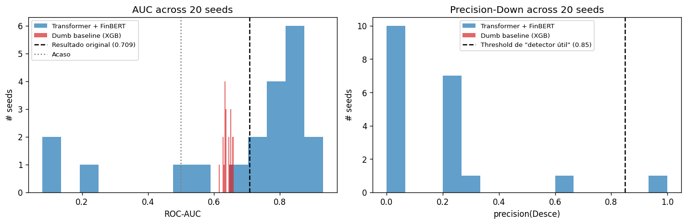
*Figure: AUC distribution over 20 seeds. Left: Transformer (bimodal). Right: Baseline (unimodal, stable).*

---

## Experiment 6: Multi-Seed × Multi-Ticker

**Notebook**: `multi_seed_multi_ticker.ipynb` | **Runs**: 120
**Question**: Does the bimodal pattern replicate across PETR4 and VALE3?

| Ticker | Δ balance (test−train) | Baseline median | Transformer median | Δ |
|---|---:|---:|---:|---:|
| ITUB4 | +0.117 | 0.682 | 0.801 | +0.119 |
| PETR4 | −0.030 | 0.587 | 0.334 | −0.253 |
| VALE3 | +0.342 | 0.679 | 0.992 | +0.313 |

**Key finding**: The Transformer's AUC varies from 0.33 (PETR4) to 0.99 (VALE3) — a 0.66 range for the same model architecture. The correlation with class-prior shift (test−train balance) suggests the Transformer is a **prior-matching classifier**, not a true predictor.

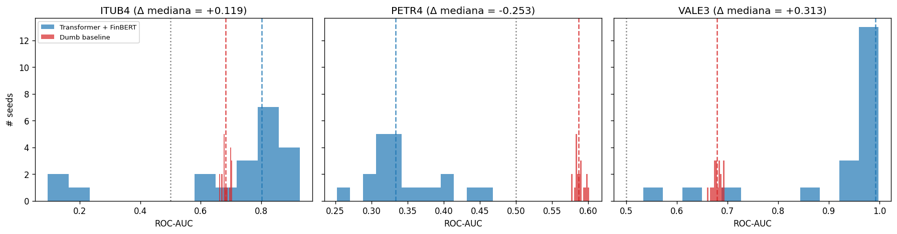

---

## Experiment 7: Ensemble + Backtest

**Notebook**: `ensemble_backtest.ipynb` | **Runs**: 20
**Question**: Can ensembling multiple seeds stabilize the Transformer into a usable strategy?

**Protocol**: Train 20 seeds, filter by validation AUC ≥ 0.5, ensemble surviving models, run long/flat backtest.

**Result**: Only 2/20 seeds pass validation filter. The ensemble achieves AUC = 0.137 on test. The long/flat strategy stays out of the market 100% of the time.

| Strategy | Total Return | Sharpe |
|---|---:|---:|
| Buy-and-hold ITUB4 | +50.30% | 3.25 |
| Long/flat ensemble | −0.10% | −1.29 |

**Key finding**: Validation-test AUC correlation is **negative**. Seeds that look good on validation are the worst on test. Model selection via validation is fundamentally broken in this non-stationary regime.

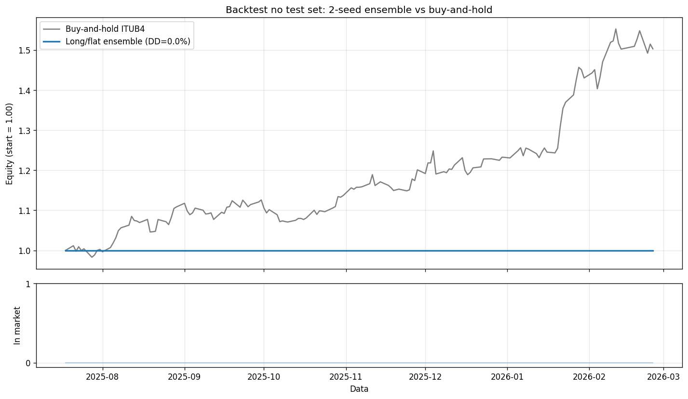

---

## Experiment 8: Expanding-Window Cross-Validation

**Notebook**: `expanding_window_cv.ipynb` | **Runs**: 145
**Question**: What happens under multi-fold evaluation?

**Protocol**: Min train 600 days, val/test 90 days, step 90 days. 5 folds × 5 seeds × 3 tickers × 2 models.

| Ticker | Baseline XGB | Transformer | Δ |
|---|---:|---:|---:|
| ITUB4 | **0.700** | 0.445 | −0.255 |
| PETR4 | **0.702** | 0.447 | −0.255 |
| VALE3 | 0.599 | 0.635 | +0.036 |
| **Mean** | **0.667** | 0.509 | **−0.158** |

**Key finding**: Under proper evaluation, the baseline wins decisively in 2/3 tickers by 0.25 AUC points. The Transformer operates near chance (~0.51) on average. VALE3's apparent +0.036 is investigated in Experiment 10.

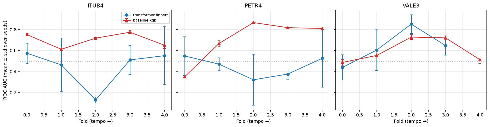
*Figure: AUC by fold over time. Red (baseline) consistently above blue (Transformer) in ITUB4 and PETR4.*

---

## Experiment 9: Horizon Sweep

**Notebook**: `horizon_sweep.ipynb` | **Runs**: 6
**Question**: How does baseline AUC vary with prediction horizon?

| Horizon (days) | AUC [95% CI] | Test Balance |
|---:|---|---:|
| 1 | 0.487 [0.403, 0.570] | 55.7% |
| 2 | 0.497 [0.414, 0.581] | 56.2% |
| 5 | 0.518 [0.442, 0.600] | 59.8% |
| 10 | 0.418 [0.328, 0.501] | 61.4% |
| 21 | 0.632 [0.531, 0.729] | 69.2% |
| 42 | 0.802 [0.677, 0.907] | 86.6% |

**Key finding**: AUC *increases* with horizon, driven by class imbalance. At h=42, 86.6% of the test is "Up" — a model that learns this tendency gets AUC = 0.80 without real predictive power. Short horizons (h ≤ 5) are near random.

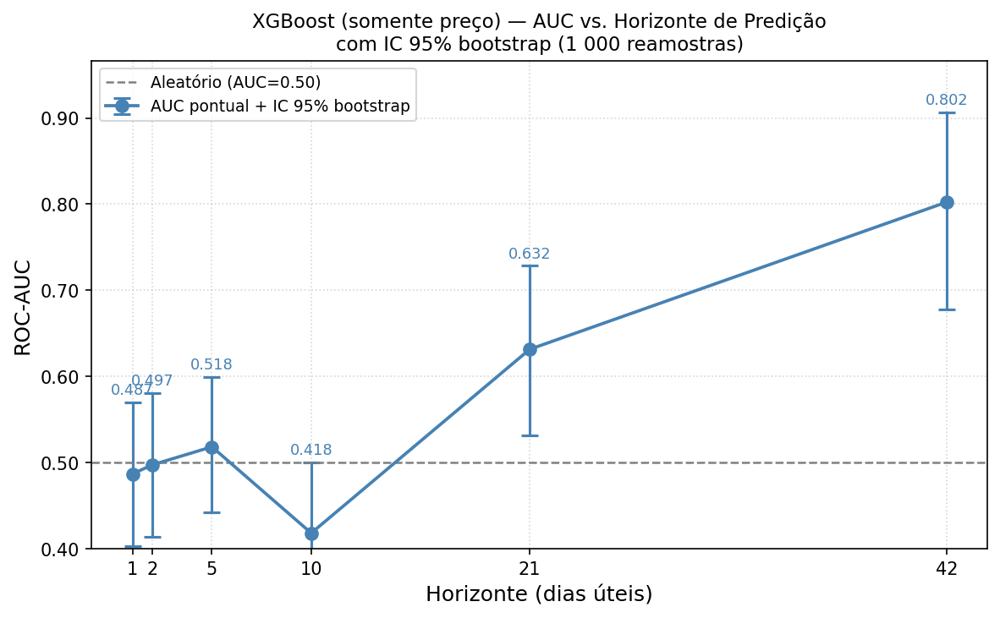

---

## Experiment 10: VALE3 Deep-Dive

**Notebook**: `vale3_deepdive.ipynb` | **Runs**: 880
**Question**: Is VALE3's +0.036 advantage (Experiment 8) real?

**Protocol**: 52 folds × 10 seeds × 2 models = 880 runs on VALE3 only. Wilcoxon signed-rank test.

| Statistic | Value |
|---|---:|
| Transformer AUC mean | 0.484 |
| Baseline AUC mean | 0.535 |
| Δ mean (trans − base) | −0.051 |
| Folds where trans wins | 14/39 (36%) |
| Wilcoxon p-value | **0.194** |
| Bootstrap 95% CI on Δ | [−0.136, +0.033] |
| CI contains zero? | **Yes** |

**Key finding**: With 8× more data points, the VALE3 advantage **inverts**. The Transformer is worse by 0.051 AUC, and the difference is not significant. The histogram reveals the same bimodal collapse pattern.

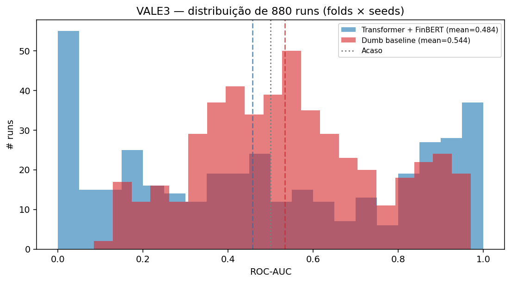
*Figure: Distribution of 880 AUCs. Left: Baseline (unimodal ~0.55). Right: Transformer (bimodal, peaks at AUC < 0.05 and AUC > 0.95).*

---

## Experiment 11: Ablation — PRICE vs SENT vs PRICE+SENT

**Notebook**: `ablation_price_vs_sentiment.ipynb` | **Runs**: 225
**Question**: Does sentiment add any incremental signal to price features?

**Protocol**: XGBoost under expanding-window CV. 3 feature sets × 3 tickers × 5 folds × 5 seeds.

| Ticker | PRICE | SENT | PRICE+SENT | Δ (P+S − P) |
|---|---:|---:|---:|---:|
| ITUB4 | 0.684 | 0.436 | 0.651 | −0.033 |
| PETR4 | 0.692 | 0.494 | 0.676 | −0.016 |
| VALE3 | 0.609 | 0.510 | 0.667 | +0.058 |
| **Mean** | **0.662** | 0.480 | 0.665 | **+0.003** |

**Statistical test** (75 paired observations):
- Δ mean = **+0.003**
- Wilcoxon p = **0.49**
- Bootstrap 95% CI: **[−0.012, +0.018]** (contains zero)
- PRICE+SENT wins in only 32/75 pairs (43%)

**Key finding**: Sentiment adds Δ = +0.003 AUC — statistically and practically zero. SENT alone operates below chance (0.480). The result is definitive: **sentiment features do not add measurable predictive signal**.

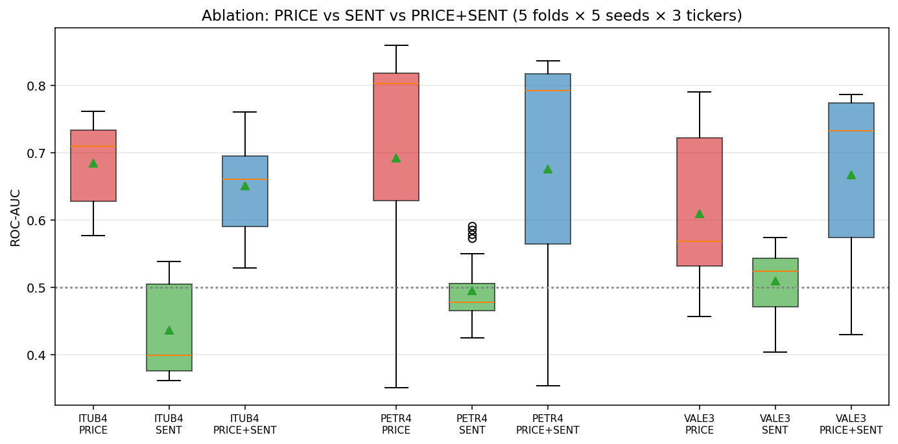
*Figure: PRICE and PRICE+SENT are statistically indistinguishable. SENT alone is below chance.*

---

## Experiment 11b: Ablation with h=5

**Notebook**: `ablation_h5.ipynb` | **Runs**: 225
**Question**: Does the conclusion change with a shorter horizon?

| Ticker | PRICE | SENT | PRICE+SENT | Δ |
|---|---:|---:|---:|---:|
| ITUB4 | 0.533 | 0.435 | 0.523 | −0.010 |
| PETR4 | 0.539 | 0.583 | 0.545 | +0.005 |
| VALE3 | 0.583 | 0.426 | 0.580 | −0.003 |
| **Mean** | **0.552** | 0.482 | 0.549 | **−0.002** |

Wilcoxon p = 0.862, CI [−0.093, +0.085]. **Conclusion identical at h=5: sentiment adds nothing.**

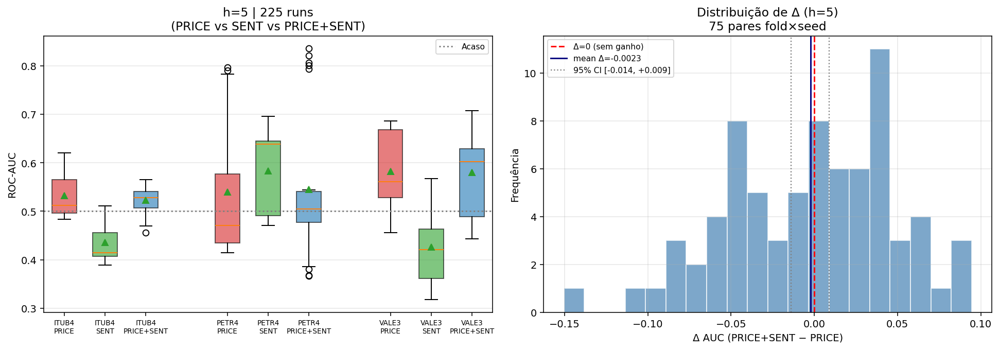

---

## Experiment 12: Forward-Fill Sensitivity

**Notebook**: `ffill_sensitivity.ipynb` | **Runs**: 50
**Question**: Does forward-fill introduce look-ahead bias?

| Strategy | AUC mean | Std |
|---|---:|---:|
| Same-day (original) | 0.666 | 0.072 |
| Lag-1d (conservative) | 0.643 | 0.054 |
| Δ (lag − same) | −0.022 | |
| Wilcoxon p | 0.030 | |

**Key finding**: Forward-fill introduces a modest positive bias of ~0.022 AUC. This is systematic (p = 0.030) but irrelevant: both strategies produce AUCs in the baseline range (~0.66), and the bias is too small to affect the null conclusion about sentiment.

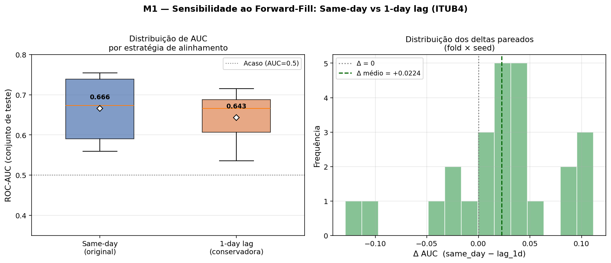

---

## Experiment 13: Power Analysis

**Notebook**: `power_analysis.ipynb`
**Question**: Are the test sets large enough to detect real effects?

Using Hanley & McNeil (1982) standard error formula:

| Scenario | N | Balance | SE | MDE (80% power) |
|---|---:|---:|---:|---:|
| Walk-forward (full) | 177 | 69% | 0.047 | 0.132 |
| Expanding-window fold | 60 | 60% | 0.077 | 0.215 |

**Key finding**: The observed sentiment effect (Δ = +0.003) is **44–74× below** the minimum detectable effect size. Even if sentiment had a real effect of 0.05 AUC, these test sets couldn't detect it. The Transformer's collapse (Δ = −0.255) is well above MDE and is robustly detectable.

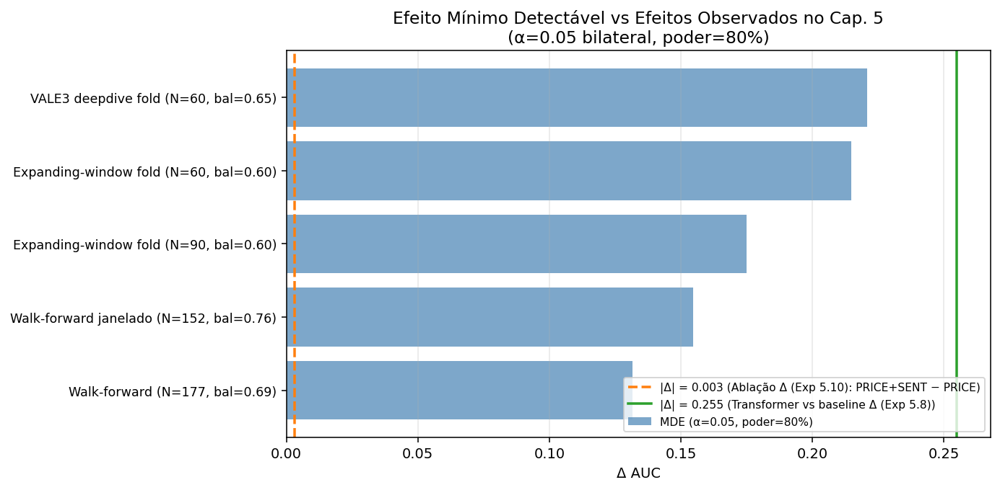

---

## Experiment 14: TCN Validation

**Notebook**: `tcn_validation.ipynb` | **Runs**: 45
**Question**: Does the TCN's AUC = 0.643 (Stage 5b) survive multi-seed and multi-fold evaluation?

**Multi-seed (20 seeds, single window)**:
- Mean AUC = 0.513, Std = 0.102, 60% of seeds below 0.50

**Expanding-window CV (5 folds × 5 seeds)**:
- Mean AUC = 0.556, below baseline (0.700) by 0.144

**Key finding**: The TCN is more stable than the Transformer (std 0.102 vs 0.261) but equally incapable of beating the price baseline. Its 0.643 is a percentile-80 result, not representative.

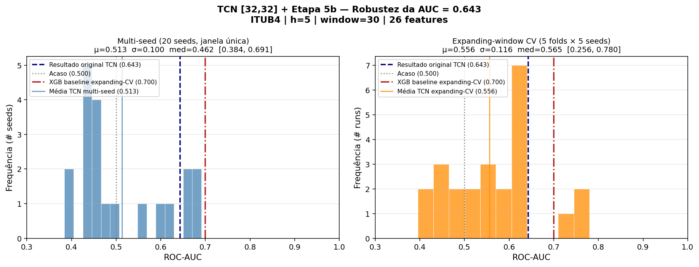

---

## Unified Conclusion

> Under methodologically correct evaluation (multi-fold, multi-seed, with confidence intervals and feature ablation), FinBERT-PT-BR sentiment features do not add measurable predictive signal to an autoregressive baseline of 5 price features, for any of the 3 Brazilian large-cap stocks tested. The original AUC = 0.709 is an artifact of single-window evaluation.

## CSV Results Files

| File | Contents |
|---|---|
| `results_dumb_baseline.csv` | Autoregressive baseline results |
| `results_naive_baselines.csv` | Naive predictor results |
| `results_dimensionality_control.csv` | Random Ollama subsets |
| `results_multi_seed.csv` | 20-seed ITUB4 results |
| `results_multi_seed_multi_ticker.csv` | 120-run cross-ticker results |
| `results_expanding_cv.csv` | Expanding-window CV raw results |
| `results_expanding_cv_fold_agg.csv` | CV results aggregated by fold |
| `results_horizon_sweep.csv` | Horizon sweep results |
| `results_vale3_deepdive.csv` | 880-run VALE3 results |
| `results_ablation.csv` | Ablation raw results (h=21) |
| `results_ablation_h5.csv` | Ablation raw results (h=5) |
| `results_ffill_sensitivity.csv` | Forward-fill sensitivity |
| `results_power_analysis.csv` | Power analysis parameters |
| `results_tcn_validation.csv` | TCN validation results |
| `ablation_summary.csv` | Ablation aggregated summary (h=21) |
| `ablation_h5_summary.csv` | Ablation aggregated summary (h=5) |
| `multi_seed_summary.csv` | Multi-seed aggregated stats |
| `multi_seed_multi_ticker_summary.csv` | Multi-ticker aggregated stats |
