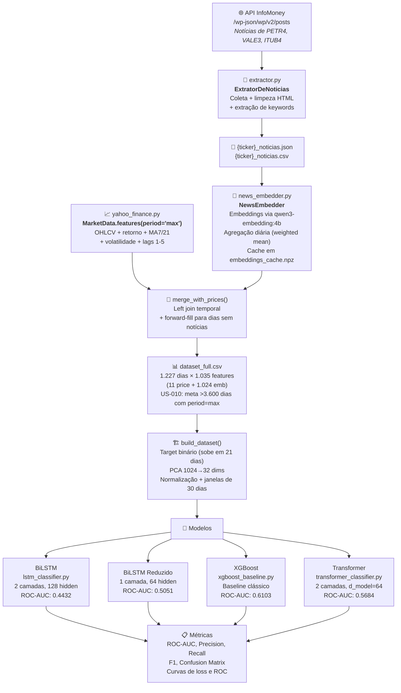

# Diagrama do Pipeline de Predição de Preços

## Fluxo de dados resumido

1. **Coleta** → API InfoMoney fornece artigos em JSON via REST API do WordPress
2. **Extração** → `extractor.py` limpa HTML, normaliza texto, extrai keywords
3. **Features de mercado** → `yahoo_finance.py` busca OHLCV e calcula indicadores técnicos
4. **Embeddings** → `news_embedder.py` gera vetores de 1024 dims via Ollama, agrega por dia
5. **Merge** → Combina preços + embeddings por data, forward-fill para dias sem notícias
6. **Preparação** → PCA, normalização, janelamento temporal
7. **Modelos** → BiLSTM (original e reduzido), XGBoost, Transformer
8. **Avaliação** → Métricas de classificação com validação walk-forward
